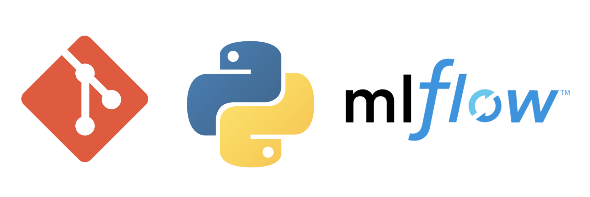
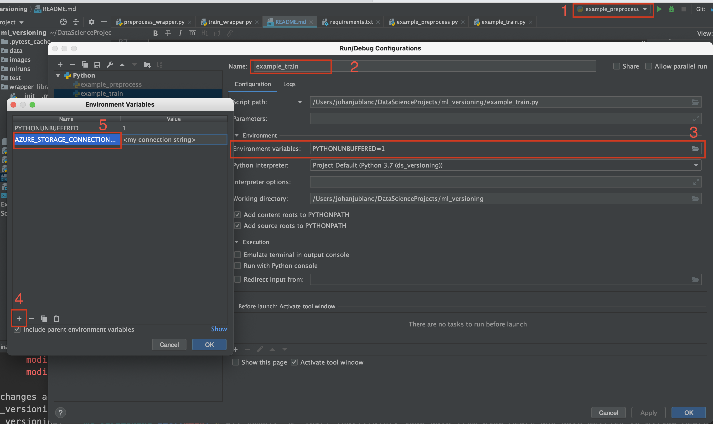

# Description



When working on a machine learning project it quite easy to loose track of 
your experiments, all the more so as you are working in a team.

Many open tools already exist to help data scientists keeping track of there 
work, such as mlflow tracker. In order to track metrics, models and visualize 
your experiments this tool is just perfect.

However, when tracking parameters I encountered some difficulties making my 
experiments perfectly reproducibles, mainly because an experiment is often 
more than a set of parameters. Indeed in many case the shape of the model can't be easily reproduced, for instance :
* when the final solution is a combination of multiple ML models,
* when adding a business rule or a rectification step,
* when complexe deep learning architecture. 

Moreover, it is not always particular to keep track on data used to get a 
particular level of performances, and for a particular dataset it is not always
possible to remind which exact transformations have been performed on the row 
data.

Even if it is possible to retrieve the architecture and all information about 
the model, it is often not straight forward to go back to a particular 
experiment relaunch it ad iterate from this point.

This is why I use mlflow and "git python" to commit automatically my code and 
my experiment's results each time I preprocess data or I train a model. 
I use simple but efficient ids to track everything. For the data I use a time 
stamps and for the training I use the run id given by mlflow.

# Usage

You just have to install the module and call it in your script.
```
from wrapper.preprocess_wrapper import preprocess_wrapper
```

Then use wrappers as decorators of preprocessing ad training functions like 
this

```
@train_wrapper
def train():
    [...]
    results = {"metrics":metrics,
               "model":model}
    return results
```
```
@preprocess_wrapper
def preprocess(X: pd.DataFrame, y: pd.Series):
    [...]
    return {"data_1":data_1, "data_2":data_2, ...}
```

Finally use your function as usual with a few more parameters to handle 
commits, data savings and model versionning.

```
train(wrapper_branch="main",
      wrapper_gitwd=cwd)
```

```
preprocess(wrapper_branch="main",
           wrapper_gitwd=cwd,
           wrapper_data_path='data/iris.csv',
           wrapper_target_cols="target")
```

# Settings

If you have conda installed and you are on a bash shell, you can create and 
activate a conda environment sourcing the bash file as following.

```
source settings.sh ds_versioning
```

You also can use another kind of environment ad install dependencies.

```
pip install -r requirements.txt
```

If you want to use Azure functionality, you'll have to get your connection 
string to Azure storage and your Azure Workspace config.

__Get your Azure Workspace config__
Go to the page of your resource group and download the config.json file. Put 
the file at the root of your project.

__Get you Azure Storage access key__
Go to the page of the storage of your resource group 'pocorange-rg' and copy 
the connection string. Then create an env variable containing your connection
string.

If you run your preprocess and train scripts from Pycharm Console you can 
add env var going trough the folloxing steps :
* 1 Edit run configurations
* 2 Select the run for which you want to add a env var
* 3 Open Ennvironement Vriables folder
* 4 Add a new variable
* 5 Name it AZURE_STORAZGE_CONNECTION_STRING and past the value of your 
connection string.  



On bash (and bash like shells)
```
export AZURE_STORAGE_CONNECTION_STRING="<connexion string 1>"
```

On Powershell
```
setx AZURE_STORAGE_CONNECTION_STRING "<connexion string 1>"
```

# Test & examples

To launch unitary tests you can run pytest like that :
```
python -m pytest
```

To launch an example with a preprocessing function use the following command
```
python example_preprocess.py
```

To launch an example with a training function use the following command
```
python example_preprocess.py
```